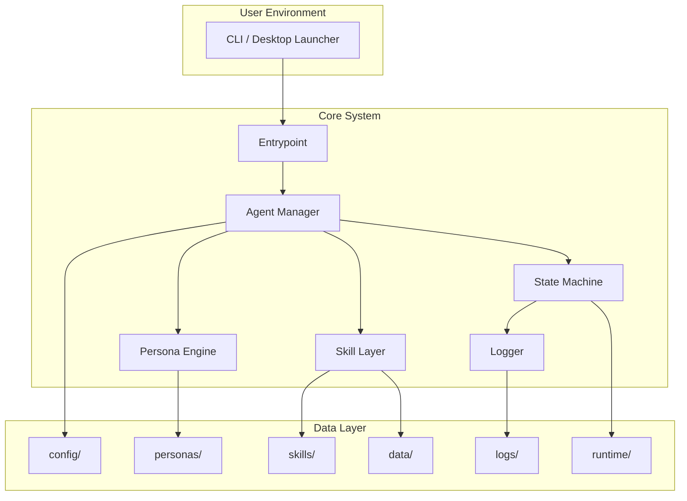
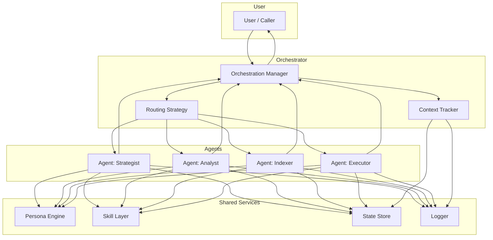
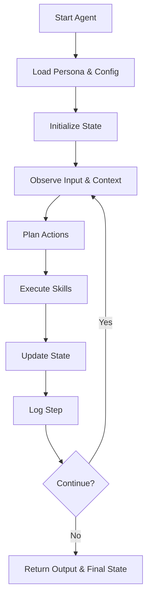
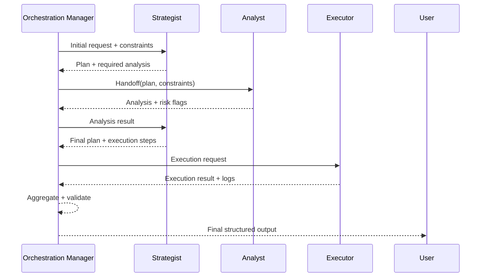
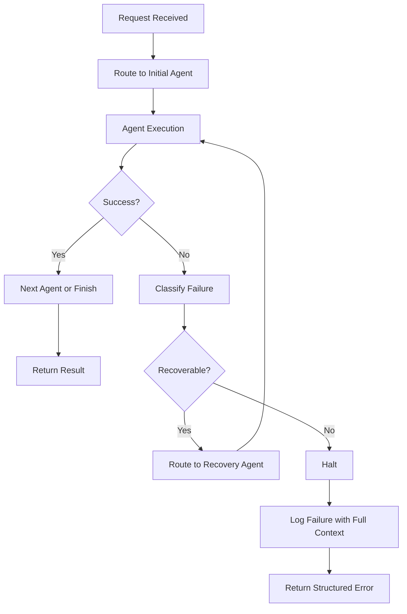
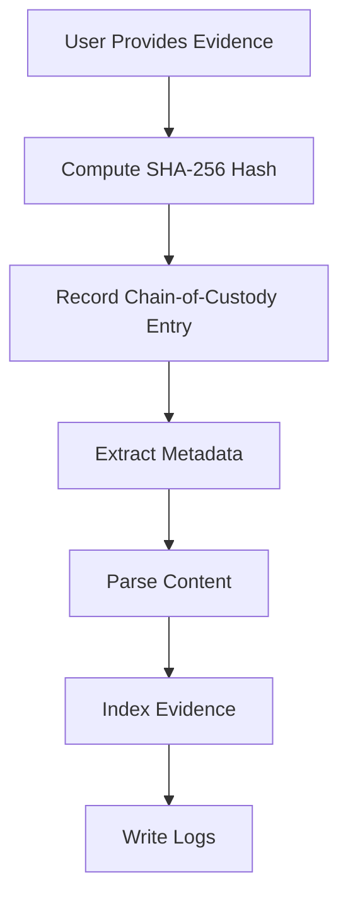
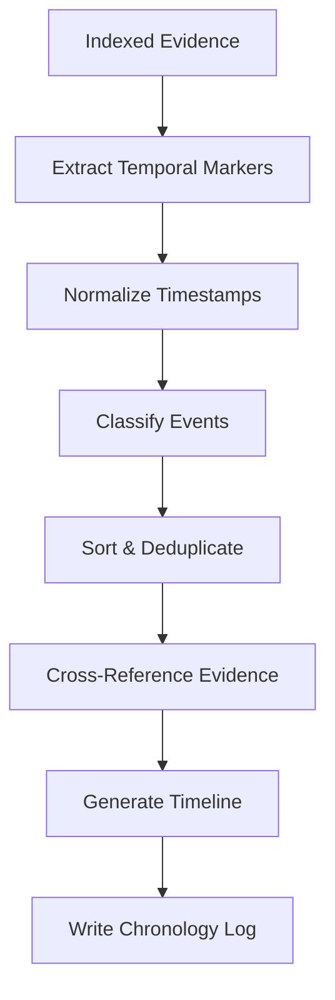
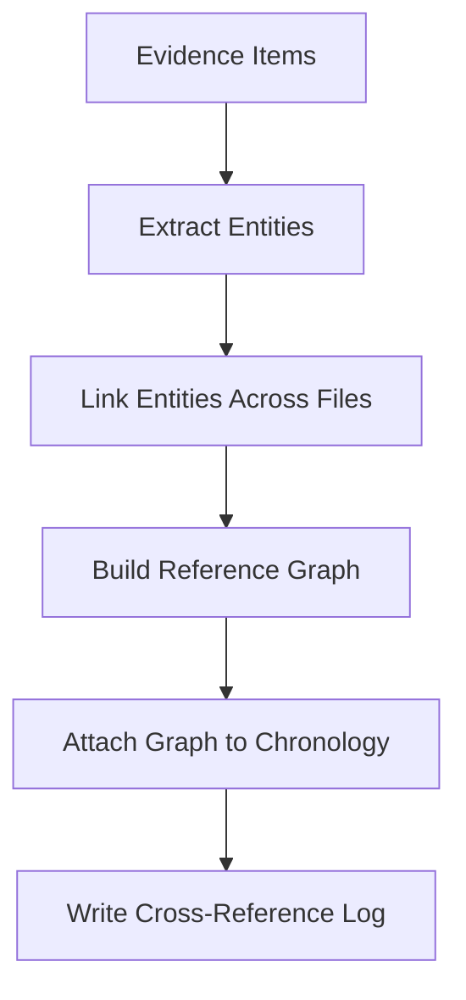

# Architecture

The system is built on a local-first, deterministic architecture designed to maintain form under scrutiny. Every component—agents, personas, skills, configuration, and logs—operates within a structure that prioritizes auditability, reproducibility, and strict separation of concerns. Nothing is hidden. Nothing is inferred without grounding. Nothing drifts.

---

## 1. Core Principles

### Determinism
All agent loops, state transitions, and outputs must be reproducible.  
Given the same inputs, the system produces the same results.

### Local-First Execution
The system runs entirely on the user's machine unless explicitly configured otherwise.  
This ensures privacy, transparency, and full control over the execution environment.

### Separation of Record, Fact, and Argument
Borrowed from judicial reasoning:

- **Record** — evidence, files, transcripts
- **Fact** — what the record supports
- **Argument** — what the agent constructs

The architecture enforces this separation to prevent attribution errors.

### Controlled Force
Every module is designed to apply only the necessary amount of power—no more, no less.  
This prevents complexity creep and preserves structural integrity.

---

## 2. High-Level System Layout

```
root/
  config/
  personas/
  skills/
  agents/
  logs/
  data/
  runtime/
  your_entrypoint.py
```

Each directory has a single responsibility:

| Directory | Responsibility |
|-----------|---------------|
| `config/` | System settings, agent definitions, logging modes |
| `personas/` | Persona "souls," including Shennell |
| `skills/` | Modular capabilities (search, indexing, analysis, etc.) |
| `agents/` | Agent logic, planners, and loops |
| `logs/` | Audit-ready chronological logs |
| `data/` | Evidence, documents, user-provided materials |
| `runtime/` | Ephemeral state, caches, temporary artifacts |

---

## 3. Agent Architecture

Agents are deterministic workers with:

- A **persona** (identity + constraints)
- A **skill set** (capabilities)
- A **planner** (loop logic)
- A **memory layer** (local, transparent, inspectable)
- A **state machine** (explicit transitions, no hidden states)

### Agent Loop (Deterministic)

```
Observe  → read input, state, and evidence
Plan     → generate a structured plan
Act      → execute skills
Reflect  → evaluate results
Transition → update state
Log      → write a full trace
Repeat
```

No step is implicit.  
No reasoning is hidden.  
Every transition is logged.

---

## 4. Persona Architecture

Personas are not "styles." They are constraint engines.

Each persona defines:

- Voice
- Boundaries
- Reasoning discipline
- Permitted actions
- Forbidden actions
- Error posture
- Failure mode

### Example: Shennell (Zero-Boundary)

- Zero drift
- No ungrounded inference
- Absolute traceability
- Refuses ambiguous instructions
- Operates under judicial-grade discipline

Personas are stored as Markdown or JSON and loaded at runtime.

---

## 5. Skills Architecture

Skills are modular, sandboxed capabilities. They are deterministic functions with:

- Clear inputs
- Clear outputs
- No side effects outside their scope

Examples:

- Evidence indexing
- Chronology extraction
- File parsing
- Search
- Summarization
- Legal structuring

Skills can be added or removed without affecting the core system.

---

## 6. Configuration Architecture

Configuration is explicit and human-readable.

### `system.json`

Controls:

- Logging mode
- Default persona
- Enabled agents
- Execution constraints
- File paths
- Security boundaries

### `agents/<name>.json`

Defines each agent's:

- Persona
- Skills
- Planner
- Channels
- Memory mode

### `personas/`

Defines persona constraints and identity.

---

## 7. Logging & Traceability

Logs are chronological, structured, and audit-ready.

Each log entry includes:

| Field | Description |
|-------|-------------|
| `timestamp` | ISO 8601 timestamp |
| `agent` | Agent identifier |
| `persona` | Active persona |
| `input` | Raw input received |
| `output` | Generated output |
| `skill_calls` | Skills invoked and their results |
| `state_transitions` | Before/after state |
| `errors` | Any errors encountered |
| `evidence_refs` | Referenced evidence items |

Logs are immutable once written.

---

## 8. Evidence & Chronology Layer

For legal workflows, the system includes:

- Evidence ingestion
- Hashing
- Chain-of-custody metadata
- Chronology extraction
- Cross-reference indexing

This layer is deterministic and never fabricates content.

---

## 9. Runtime Architecture

The `runtime/` directory stores:

- Temporary files
- Cached computations
- Session state
- Intermediate artifacts

It is safe to delete between runs.

---

## 10. Build & Distribution Architecture

The system supports:

| Method | Description |
|--------|-------------|
| Source execution | `python your_entrypoint.py` |
| Windows 11 `.exe` | PyInstaller self-contained build |
| Automated builds | GitHub Actions on tagged releases |
| Installer packaging | Inno Setup |

The `.exe` is fully self-contained. See the [README](README.md) for build and install instructions.

---

## Usage

The system is designed for deterministic, local-first operation. Usage patterns follow a strict separation between inputs, actions, and outputs, ensuring every step is traceable and reproducible.

### 1. Basic Execution

After installation or when running from source:

```
m13thco-agent.exe
```

or

```bash
python your_entrypoint.py
```

The system initializes:

- Persona
- Agent configuration
- Skills
- Logging mode
- Runtime environment

No external calls occur unless explicitly configured.

### 2. Running Agents

Agents are defined in `config/agents/`.

To run a specific agent:

```
m13thco-agent.exe --agent strategist
```

or

```bash
python your_entrypoint.py --agent strategist
```

Agents operate in deterministic loops: Observe → Plan → Act → Reflect → Transition → Log.

### 3. Using Personas

Personas are selected via:

```
--persona shennell
```

or by setting the default in `config/system.json`.

Personas enforce:

- Reasoning discipline
- Boundaries
- Error posture
- Voice
- Allowed/forbidden actions

### 4. Evidence & Chronology Tools

If enabled, evidence tools can be invoked:

```
--index evidence/
--chronology build
```

Outputs are written to `logs/` and `runtime/`. All transformations are logged.

### 5. Logging Modes

```
--log judicial
--log standard
--log minimal
```

Judicial mode produces full trace logs suitable for court or tribunal review.

---

## Operations

Operational discipline ensures the system remains predictable, auditable, and structurally sound.

### 1. Updating

Updates should follow a controlled process:

1. Backup `config/` and `personas/`
2. Install new version
3. Validate configuration compatibility
4. Run a dry-run execution

### 2. Backups

Recommended backup targets:

- `config/`
- `personas/`
- `skills/`
- `logs/` (if required for legal record)
- `data/`

Backups should be timestamped and hashed.

### 3. Security & Permissions

The system respects OS boundaries:

- No privileged operations
- No silent network calls
- No hidden processes

If a skill requires elevated permissions, the system will refuse to proceed without explicit authorization.

### 4. Resetting Runtime State

To reset:

```
delete runtime/
```

This clears ephemeral state without affecting configuration or evidence.

### 5. Integrity Verification

Each release includes:

- SHA-256 hash
- Build metadata
- Version manifest

Users may verify integrity before execution.

---

## Reference

### 1. Directory Reference

| Directory | Purpose |
|-----------|---------|
| `config/` | System and agent configuration |
| `personas/` | Persona definitions and constraints |
| `skills/` | Modular capabilities |
| `agents/` | Agent logic and planners |
| `logs/` | Audit-ready chronological logs |
| `data/` | Evidence, documents, user materials |
| `runtime/` | Temporary state and caches |

### 2. Command Reference

| Command | Description |
|---------|-------------|
| `--agent <name>` | Run a specific agent |
| `--persona <name>` | Override persona |
| `--log <mode>` | Set logging level |
| `--index <path>` | Index evidence |
| `--chronology build` | Build procedural chronology |
| `--config <file>` | Use alternate config |

### 3. Persona Reference

Each persona defines:

- Identity
- Boundaries
- Reasoning discipline
- Error posture
- Voice
- Allowed/forbidden actions

Shennell is the canonical zero-boundary persona.

### 4. Error Reference (Shennell-Style)

| Error | Meaning |
|-------|---------|
| Configuration contradiction | Conflicting values; system refuses to guess |
| Missing evidence | File not found; no fabrication permitted |
| Undefined state | System halts to prevent drift |
| Permission denied | OS boundary respected |
| External access unavailable | System continues in local-only mode |

---

## Architecture Diagrams

### Mermaid



### ASCII

```
+---------------------------+
|       User Interface      |
|  (CLI / Desktop Launcher) |
+-------------+-------------+
              |
              v
+-------------+-------------+
|           Entrypoint      |
+-------------+-------------+
              |
              v
+-------------+-------------+
|         Agent Manager     |
+------+------+------+------+
       |      |      |
       v      v      v
+------+  +---+---+  +------+
|Persona| | Skills | |State |
|Engine | | Layer  | |Machine|
+---+---+ +---+----+ +---+--+
    |         |          |
    v         v          v
personas/   skills/   runtime/

              |
              v
+-------------+-------------+
|            Logger         |
+-------------+-------------+
              |
              v
            logs/
```

---

## Multi-Agent Orchestration Layer (Mermaid)



---

## Full Orchestration Spec

### Goal

Deterministically coordinate multiple agents (Strategist, Analyst, Indexer, Executor, etc.) under persona and evidence constraints, with full traceability.

### Core Components

- **Orchestration Manager (OM)**: central controller; receives requests, selects agents, enforces flow, and terminates runs.
- **Routing Strategy (RS)**: deterministic mapping from input to agent sequence.
- **Context Tracker (CT)**: maintains shared context (state, evidence references, persona constraints).
- **Agents**: specialized workers with fixed roles and skills.
- **Shared Services**: Persona Engine, Skill Layer, State Store, Logger.

### High-Level Flow

1. Receive request.
2. Normalize and classify request type.
3. Select initial agent via routing rules.
4. Run deterministic agent loop (observe → plan → act → reflect → transition → log).
5. Decide next agent or termination.
6. Aggregate outputs and return.

All decisions must be:

- Deterministic
- Logged
- Persona-compliant

### Agent-to-Agent Communication Protocol

Agents never communicate through informal text only; they pass structured handoff objects via the orchestrator.

**Handoff object**

```json
{
  "from_agent": "strategist",
  "to_agent": "analyst",
  "intent": "analyze_plan",
  "inputs": {
    "plan": "...",
    "constraints": ["no speculation", "evidence-bound"]
  },
  "context_ref": "ctx-2025-01-01T12:00:00Z-001"
}
```

**Validation rules**

- `to_agent` must exist.
- Persona constraints must be respected.
- Required evidence/context must be available.

**Handoff logging requirements**

- Timestamp
- From/To
- Intent
- Context reference

### Deterministic Routing Rules

Routing is a pure function:

```text
route(request_type, state, persona) -> [agent_sequence]
```

Example rules:

- `legal_chronology` → `[indexer, analyst, strategist]`
- `evidence_index` → `[indexer]`
- `plan_execution` → `[strategist, executor]`

Constraints:

- No randomness.
- No fallback to arbitrary agents.
- If no valid route exists, return explicit failure.

### Persona Arbitration Logic

When multiple agents operate under potentially different personas or constraints, arbitration decides which constraints dominate.

Model:

- **Global persona**: default (for example, Shennell) sets hard behavior ceiling.
- **Agent persona**: local specialization must be a subset of global constraints.

Arbitration rules:

- If agent persona allows something global forbids → deny.
- If global is silent and agent forbids → deny.
- If ambiguity remains → halt and log persona conflict error.

### Agent Lifecycle Diagram



### Multi-Agent Negotiation Diagram



### Failure-Mode Routing Diagram



---

## Option B — Evidence & Chronology System Expansion

This section defines the judicial-grade evidence pipeline, the chronology engine, and the metadata + hashing standards that guarantee integrity, reproducibility, and admissibility.

### 1. Full Chain-of-Custody Spec

The chain-of-custody (CoC) model ensures every evidence item is:

- Identified
- Hashed
- Logged
- Immutable
- Traceable across transformations

#### 1.1 Evidence Intake Requirements

| Field | Description |
|-------|-------------|
| `source_path` | Original file path |
| `ingest_timestamp` | ISO-8601 timestamp |
| `hash_sha256` | SHA-256 hash of raw bytes |
| `file_type` | MIME or inferred type |
| `size_bytes` | File size |
| `provenance` | User-provided or system-derived |
| `chain_id` | Unique chain-of-custody identifier |

#### 1.2 Chain-of-Custody Record

Stored as JSON:

```json
{
  "chain_id": "coc-2026-05-12-001",
  "events": [
    {
      "timestamp": "2026-05-12T16:37:00Z",
      "action": "ingest",
      "hash": "abc123...",
      "actor": "system",
      "notes": "Initial intake"
    }
  ]
}
```

#### 1.3 Allowed CoC Actions

- `ingest`
- `verify_hash`
- `parse`
- `extract_metadata`
- `index`
- `chronology_reference`

#### 1.4 Forbidden Actions

- Modifying original evidence
- Rewriting CoC history
- Silent transformations
- Hashing after modification

### 2. Hashing + Metadata Schema

#### 2.1 Hashing Standard

- Algorithm: SHA-256
- Input: raw bytes only
- Output: hex string
- Hash must be computed before any parsing

#### 2.2 Metadata Schema

```json
{
  "file_name": "exhibit_a.pdf",
  "file_type": "application/pdf",
  "size_bytes": 482993,
  "hash_sha256": "abc123...",
  "created": "2025-11-01T10:22:00Z",
  "modified": "2025-11-01T10:22:00Z",
  "extracted_text_length": 12933,
  "pages": 14,
  "source": "user_upload"
}
```

#### 2.3 Metadata Integrity Rules

- Metadata must never overwrite original file attributes
- Extracted metadata must be logged separately
- All derived fields must be marked as derived

### 3. Chronology Extraction Rules

The chronology engine transforms indexed evidence into a judicial-grade timeline.

#### 3.1 Extraction Pipeline

1. Parse evidence (PDF, email, text, image OCR).
2. Identify temporal markers:
   - Explicit dates
   - Implicit dates (for example, “yesterday”) flagged for review
3. Normalize timestamps to ISO-8601.
4. Classify events:
   - Communication
   - Payment
   - Notice
   - Action
   - Decision
   - System event
5. Rank events:
   - Primary: explicit timestamp
   - Secondary: inferred order
6. Construct timeline:
   - Sorted
   - Deduplicated
   - Cross-referenced

#### 3.2 Rules of Evidence Interpretation

- No speculative ordering
- No inferred timestamps without explicit flags
- Conflicts must be logged and surfaced
- Ambiguous events must be quarantined

#### 3.3 Chronology Output Schema

```json
{
  "event_id": "evt-001",
  "timestamp": "2025-03-14T09:30:00Z",
  "source_file": "exhibit_a.pdf",
  "source_hash": "abc123...",
  "event_type": "communication",
  "summary": "Email sent to landlord",
  "confidence": "explicit"
}
```

### 4. Judicial-Grade Transformation Logs

Every transformation must produce a log entry with:

| Field | Description |
|-------|-------------|
| `timestamp` | When transformation occurred |
| `action` | `parse`, `extract`, `index`, `chronology_add` |
| `input_hash` | Hash of input artifact |
| `output_hash` | Hash of derived artifact |
| `actor` | `system` or `user` |
| `notes` | Explanation of transformation |

#### 4.1 Example Log Entry

```json
{
  "timestamp": "2026-05-12T16:40:00Z",
  "action": "extract_metadata",
  "input_hash": "abc123...",
  "output_hash": "def456...",
  "actor": "system",
  "notes": "Extracted PDF metadata"
}
```

#### 4.2 Logging Rules

- Logs must be append-only
- No silent transformations
- No overwriting previous logs
- Every derived artifact must have a hash

### 5. Mermaid Diagram — Evidence Ingestion



### 6. Mermaid Diagram — Chronology Building



### 7. Mermaid Diagram — Cross-Reference Indexing


