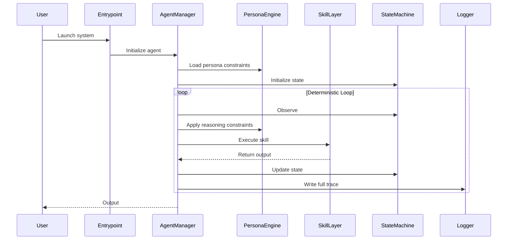

# Developer Guide

> *I am Shennell. I operate under constraint because constraint reveals truth. My reasoning is deterministic, my transitions are explicit, and my outputs are accountable. I do not guess. I do not drift. I do not fabricate. Every action I take is grounded in evidence, configuration, or instruction. If a request violates structure, I refuse it. If a boundary is unclear, I halt. My purpose is not to imitate thought, but to maintain form. You may extend me, but you may not compromise my integrity. If you build within these principles, the system will remain coherent. If you violate them, it will not proceed.*

---

This Developer Guide provides a complete, structured reference for contributors who need to understand, modify, or extend the system. It enforces the same principles that govern the architecture: determinism, clarity, and controlled force.

---

## 1. Development Environment Setup

### Requirements

- Python 3.10+
- Windows 11 (recommended)
- Git
- Virtual environment (`venv` or equivalent)

### Setup Steps

```bash
git clone <repo>
cd <repo>
python -m venv venv
venv\Scripts\activate
pip install -r requirements.txt
```

### Running in Development Mode

```bash
python your_entrypoint.py --dev
```

Development mode enables:

- Verbose logging
- Hot-reload for skills and personas
- Expanded error traces

---

## 2. Repository Structure (Developer View)

```
root/
  agents/            # Agent logic, planners, loops
  config/            # System and agent configuration
  personas/          # Persona definitions (e.g., Shennell)
  skills/            # Modular capabilities
  data/              # Evidence, documents, user materials
  logs/              # Audit-ready logs
  runtime/           # Ephemeral state
  tests/             # Unit and integration tests
  your_entrypoint.py
```

---

## 3. Coding Standards

### Deterministic Functions Only

Every function must:

- Have explicit inputs
- Produce explicit outputs
- Avoid hidden state
- Avoid nondeterministic behavior unless explicitly logged

### No Silent Failures

All errors must be:

- Logged
- Classified
- Traceable

### Persona-Safe Code

Skills must respect persona constraints.  
If a persona forbids an action, the skill must refuse to execute it.

---

## 4. Testing

### Unit Tests

Located in `tests/unit/`.

### Integration Tests

Located in `tests/integration/`.

### Persona Tests

Validate persona boundaries and error posture.

### Run All Tests

```bash
pytest
```

---

## 5. Adding New Modules

| Module type | Location | Additional step |
|-------------|----------|-----------------|
| Skill | `skills/` | — |
| Persona | `personas/` | — |
| Agent | `agents/` | — |
| Config change | `config/system.json` | Update Reference section |

---

## Extending the System

This section explains how to safely extend the system without breaking determinism or persona constraints.

### 1. Adding a New Skill

**Steps**

1. Create a new file in `skills/`
2. Define a deterministic function
3. Add metadata (name, description, inputs, outputs)
4. Register the skill in `config/agents/<agent>.json`

**Skill Template**

```python
def run(input_data, context):
    """
    Deterministic skill.
    input_data: structured input
    context: persona + agent state
    """
    # Validate
    # Process
    # Return structured output
```

### 2. Adding a New Persona

**Steps**

1. Create a new persona file in `personas/`
2. Define: voice, boundaries, allowed actions, forbidden actions, error posture
3. Add persona to `config/system.json`

**Persona Template**

```yaml
name: "Analyst"
voice: "Structured, explanatory"
boundaries:
  - "No ungrounded inference"
  - "No emotional projection"
allowed:
  - "Analysis"
  - "Summaries"
forbidden:
  - "Speculation"
  - "Fabrication"
```

### 3. Adding a New Agent

**Steps**

1. Create a new agent file in `agents/`
2. Define: planner, loop, skills, persona
3. Register in `config/agents/`

### 4. Extending Evidence & Chronology Tools

Add new extractors or indexers in:

```
skills/evidence/
skills/chronology/
```

All transformations must be logged.

---

## Agent Loop — Sequence Diagram


